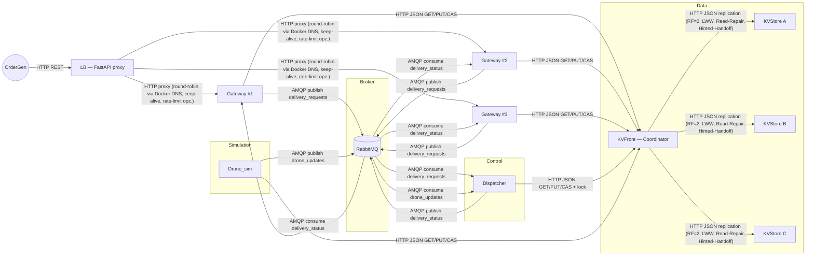
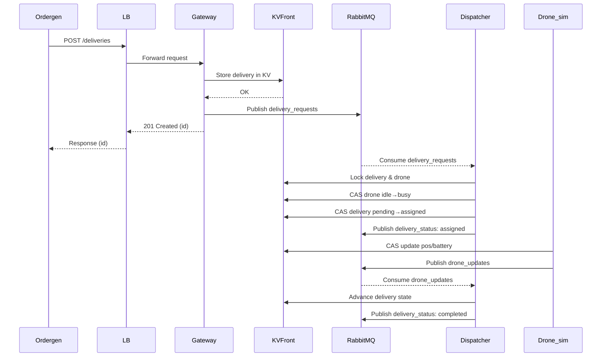
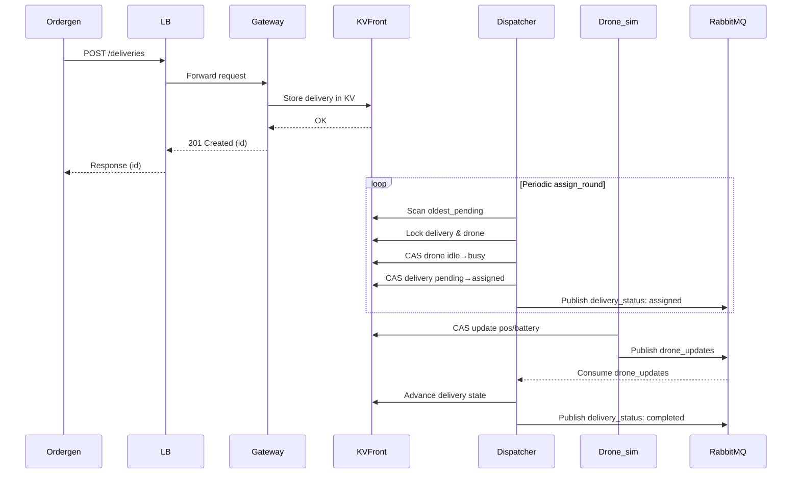

# DroneDispatch — Sistema Distribuito per la Gestione di una Flotta di Droni (PoC)

> **Link Presentazione Canvas**: https://www.canva.com/design/DAGt4jRCPEM/9r9oxmIT-ge3_p5oZ4IfYA/edit?utm_content=DAGt4jRCPEM&utm_campaign=designshare&utm_medium=link2&utm_source=sharebutton


> **Stato**: Proof of Concept funzionante, progettato per dimostrare architetture distribuite (microservizi, broker di messaggi, key-value store replicato, bilanciamento, consistenza, caching, container).


## 1. Introduzione

Il progetto **DroneDispatch** è un sistema distribuito per il coordinamento di una flotta di droni simulati destinati a effettuare consegne in ambito urbano.  
L’obiettivo principale è realizzare un **Proof of Concept (PoC)** che mostri in maniera concreta i concetti studiati durante il corso, applicandoli a un caso d’uso realistico ma semplificato.

Il sistema consente di:
- ricevere richieste di consegna da un client esterno,
- assegnare dinamicamente un drone idoneo (in base a posizione, batteria e capacità di carico),
- simulare il movimento del drone e l’evoluzione della sua batteria,
- tracciare in tempo reale lo stato delle consegne e dei droni,
- visualizzare il tutto tramite una dashboard web.

Il progetto è stato sviluppato interamente come **architettura a microservizi**, con ogni componente containerizzato tramite Docker e orchestrato tramite `docker-compose`.  
La comunicazione tra servizi avviene attraverso:
- **API REST** (per l’interfaccia esterna e le interrogazioni di stato),
- **RabbitMQ (AMQP)** per la gestione degli eventi,
- un **key-value store distribuito** per mantenere lo stato consistente e aggiornato.

Questo PoC non mira a coprire tutte le complessità di un sistema reale, ma fornisce una base completa e funzionante su cui costruire, dimostrando:
- scalabilità (replica gateway, autoscaling droni),
- consistenza tramite CAS e lock distribuiti,
- resilienza tramite read-repair e hinted handoff,
- supporto per test e validazione delle SLO tramite script dedicati.


---

## 2. Analisi dei Requisiti

### 2.1 Requisiti Funzionali

Dal comportamento effettivo del sistema implementato, i requisiti funzionali possono essere sintetizzati come segue:

- **Registrazione dei droni simulati**  
  All’avvio, il servizio `drone_sim` registra un insieme di droni nella base dati distribuita (key-value store), inizializzandone le proprietà principali (id, posizione, tipo, livello batteria, stato).

- **Ricezione richieste di consegna**  
  Il servizio `gateway` espone endpoint REST per l’invio di nuove richieste di consegna. Ogni richiesta contiene origine, destinazione e peso del pacco.

- **Assegnazione delle consegne ai droni**  
  Il servizio `dispatcher` implementa la logica di scheduling: assegna una consegna a un drone disponibile e idoneo per compiere la delivery, scegliendo tra i candidati in base a prossimità e idoneità.

- **Simulazione dello stato dei droni**  
  Il servizio `drone_sim` aggiorna periodicamente posizione e livello batteria dei droni, muovendoli verso gli obiettivi previsti (origine/destinazione o stazione di ricarica).

- **Gestione dello stato delle consegne**  
  Le consegne evolvono attraverso stati coerenti: in attesa, assegnata, in volo, completata.  
  Questo stato è persistito e aggiornato nel key-value store.

- **Monitoraggio in tempo reale**  
  La dashboard web (servita dal `gateway`) visualizza la posizione dei droni e lo stato delle consegne, interrogando periodicamente le API REST.

- **Gestione degli eventi**  
  Gli aggiornamenti dei droni vengono inviati su RabbitMQ (`drone_updates`) per essere consumati dal dispatcher e mantenere coerenza nel sistema.

---

### 2.2 Requisiti Non Funzionali

- **Scalabilità**  
  - Il gateway è stateless, quindi può essere replicato in più istanze (--scale) senza modifiche al codice, bilanciando le richieste in ingresso tramite il load balancer.
  - Il KV store è distribuito tra più nodi con consistent hashing e replication factor (RF=2). Questo permette di distribuire il carico delle scritture e letture tra più backend, supportando la scalabilità del livello di storage.  
  - Dispatcher e droni sono asincroni/event-driven, capaci di gestire più richieste concorrenti.

- **Prestazioni e bilanciamento del carico**  
  - Round-robin lato LB: Il load balancer risolve periodicamente il servizio gateway via DNS Docker, cachando tutti gli IP delle istanze e instradando a rotazione ogni richiesta verso un IP diverso.  
  - Rate limiter configurabile lato `lb`.

- **Consistenza**  
  - Uso di **CAS (Compare-and-Swap)** per aggiornamenti atomici nello store.  
  - Lock distribuiti per evitare conflitti nell’assegnazione delle consegne.  
  - Replicazione con **RF=2**, read-repair, LWW e hinted handoff nel `kvfront`.

- **Affidabilità e resilienza**  
  - Cache LRU locale nei `kvstore` per ridurre la latenza e tollerare accessi frequenti.  
  - Meccanismi di retry nelle scritture CAS e nella pubblicazione RabbitMQ.  
  - Tolleranza a guasti parziali dei `kvstore`.

- **Deployment e portabilità**  
  - Ogni componente è containerizzato con `Dockerfile` dedicato.  
  - Orchestrazione tramite `docker-compose` con healthcheck e dipendenze dichiarate.


- **Osservabilità**
  - **Dashboard web** servita dal `gateway`: visualizza posizione, batteria e stato dei droni, oltre allo stato delle consegne.
  - Script di test end-to-end.


---

## 3. Progettazione Architetturale

Questa sezione descrive **l’architettura reale** del sistema implementato: componenti (microservizi), responsabilità, interazioni (API/protocolli), motivazioni tecnologiche, e come sono stati affrontati i temi chiave dei sistemi distribuiti (scalabilità, bilanciamento, caching, consistenza, tolleranza ai guasti e resilienza). Includiamo anche diagrammi che riflettono ciò che è stato realizzato nei codici.

---


### 3.1 Componenti e responsabilità

**lb (Simple LB)**
- Proxy HTTP/1.1 keep-alive (non apre una nuova connessione TCP per ogni richiesta, ma riutilizza connessioni già stabilite) verso `gateway` (`TARGET_URL`). 
- **Rate limiting**: globale (token bucket) opzionale e configurabile via env.
- Retry *best-effort* per richieste idempotenti (GET/HEAD/PUT/DELETE) e POST con `Idempotency-Key`, in modo da evitare incosistenze.


**gateway**
- Espone **API REST** esterne (ad es. `/deliveries`, `/zones`, `/dashboard`) cioè verso ordergen e la dashbaord
- Scrive/legge stato su `kvfront` via HTTP.
- (Nel PoC) è dietro `lb` e può essere **scalato** (compose `--scale gateway=3`) grazie alla sua architettura
- Il gateway serve la dashboard che legge i dati dagli stessi endpoint REST.

**kvfront (coordinatore)**
- **Replica set**: ogni chiave viene mappata a un sottoinsieme di backend kvstore (consistent hashing)
- **RF configurabile**: il numero di backend kvstore che devono avere una copia della stessa chiave.
- **LWW (Last-Write-Wins)**: se due versioni dello stesso dato arrivano da repliche diverse, vince quella col timestamp più recente.
- **Read path**: legge da tutte le repliche del set, sceglie la più recente, e, se trova versioni vecchie fa un **read-repair** per aggiornarle.
- **Write path**: tenta su tutte le repliche; se una replica è down il front salva un hint (un promemoria con la scrittura mancata) → **hinted handoff** con flush periodico.
- **CAS distribuita**: CAS (aggiorna un valore solo se corrisponde allo stato atteso) sul primario + replicazione best-effort (prova a fare la scrittura se la replica secondaria è up altrimenti usa il meccanismo hinted handoff) su secondarie.
- **Lock distribuito**: inoltro al primario per acquire/release.

**kvstore (A/B/C)**
- **Persistenza**: Ogni kvstore è un microservizio indipendente con un proprio database SQLite. I dati sono salvati su disco (non solo in RAM), quindi persistono anche se il container si riavvia.
- **Cache LRU** Oltre al DB, ogni kvstore mantiene una cache in memoria a politica LRU che conserva solo un numero limitato di elementi e byte
- **Espone API HTTP**:  
Ogni kvstore non viene usato direttamente dal client, ma risponde a richieste che gli inoltra kvfront. Sono:
  - leggere/scrivere valori (`/kv/{key}`)  
  - fare operazioni CAS (`/kv/cas`)  
  - gestire lock locali (`/lock/*`)  
  - controllare lo stato di salute (`/health`)  
- **CAS atomica locale**:confronta il valore attuale e lo aggiorna solo se non è cambiato.

**dispatcher**  
- **Event-driven + periodic loop**:  
  - Consumer `delivery_requests` (assegnazione immediata).  
  - Consumer `drone_updates` (advance mirato).  
  - Producer `delivery_status` (pubblica aggiornamenti sullo stato delle consegne).  
  - Loop periodico: `autoscale_by_type`, `govern_charging_and_retiring`, `advance_deliveries`,`reconcile_stuck_busy` ,`assign_round`.  
- **Scheduling/assegnazione**:  
  - Selezione drone idoneo (`pick_drone`): classe peso, batteria, fattibilità energetica pos→origin→dest→charge, *bucket* distanza, *proximity rank* per zone.  
  - **Lock distribuiti** delivery/drone + **CAS doppi** (drone idle→busy; delivery pending→assigned) con rollback per rilasciare i lock in caso di fallimento 
 
- **Autoscaling logico** della flotta**:  
  - Gestione stati `inactive/idle/charging/retiring` per adeguare la capacità al backlog.  
  - Non scala i container, ma **ottimizza** l’uso della flotta disponibile.  


**drone_sim**
- **Bootstrap flotta**: registra `drone_pool_max` droni (id, type: light/medium/heavy, speed frazionale).
- **Tick per-drone**:per ogni drone gira una coroutine che ad ogni tick 
  - Legge stato, calcola nuovo `pos/battery/at_charge`, scrive con **CAS + retry**.
  - Se “charging/retiring”: naviga verso `nearest_charge_point`, poi ricarica progressiva.
  - Inserisce gli eventi di telemetria in una coda interna al processo drone_sim. (`asyncio.Queue`)
- **Publisher dedicato** : svuota la coda interna e pubblica gli eventi su RabbitMQ (coda drone_updates), con riconnessione/backoff robusti.


**rabbitmq**
- *Durable queues* (non scmoapiono se il broker RabbitMQ viene riavviato) per trigger e aggiornamenti: `delivery_requests`, `drone_updates`, `delivery_status`.

---

### 3.2 Interazioni & protocolli

**Protocolli**  
- **HTTP**  
  - tra `lb ↔ gateway`  
  - tra `gateway/dispatcher/drone_sim ↔ kvfront`  
  - tra `kvfront ↔ kvstore`

- **AMQP (RabbitMQ)**  
  - `delivery_requests`: publisher (gateway) → consumer (dispatcher)  
  - `drone_updates`: publisher (drone_sim) → consumer (dispatcher)  
  - `delivery_status`: publisher (dispatcher) → consumer (gateway)  


---

### 3.3 Scelte tecnologiche (motivazioni)

- **Python + FastAPI** per servizi HTTP/REST (rapidità di sviluppo, supporta async nativamente, ha tipizzazione con Pydantic (utile per validare request/response)).
- **httpx** libreria client HTTP (supporta chiamate asincrone con `async/await`, gestisce bene timeout, connection pooling e keep-alive).
- **aio-pika + RabbitMQ (AMQP)** RabbitMQ supporta code durabili, mentre aio-pika è una libreria client AMQP asincrona per Python che permette di aprire la connessione, creare code, pubblicare e consumare messaggi. Si integra nativamente con asyncio.
- **SQLite** nei `kvstore`: database locale leggero e persistente; è incapsulato dietro una KV API coerente
- **LRU cache** in-memory nei `kvstore` (riduce la latenza di accesso e il carico sul DB mantenendo in RAM solo gli elementi più usati).
- **Docker** + `docker-compose` (portabilità, orchestrazione locale facile, scaling).
- **CAS + lock**: meccanismi espliciti di **consistenza** sulla singola chiave interessata.


### 3.4 Diagrammi

#### 3.6.1 Component diagram



---


#### 3.6.2 Deployment 

| Servizio        | Porta interna | Porta esposta (compose) | Protocollo                         |
|-----------------|---------------|--------------------------|------------------------------------|
| **LB**          | 8080          | 8080                     | HTTP REST                          |
| **Gateway #1-3**| 8000          | — (dietro LB)            | HTTP REST + AMQP client            |
| **KVFront**     | 9000          | 9000                     | HTTP JSON                          |
| **KVStore A/B/C**| 9000         | 9001/9002/9003 (diversi container) | HTTP JSON                          |
| **Dispatcher**  | —             | —                        | HTTP JSON + AMQP                   |
| **Drone_sim**   | —             | —                        | HTTP JSON (client) + AMQP          |
| **OrderGen**    | —             | —                        | HTTP REST (client)                 |
| **RabbitMQ**    | 5672 / 15672  | 5672 / 15672             | AMQP (5672) / Mgmt UI (15672, opz.)|


#### 3.6.3 Sequence Diagram 

#### (Flusso Event-Driven (con coda delivery_requests))



#### Flusso Diretto (Polling Periodico assign_round)




## 4. Piano di Sviluppo

Il percorso di sviluppo del Proof of Concept (PoC) è stato organizzato in **milestone incrementali**, ciascuna volta a introdurre un componente chiave e verificarne il corretto funzionamento all’interno del sistema distribuito.

### 4.1 Milestone principali

1. **Setup ambiente e orchestrazione base**
   - Creazione dei `Dockerfile` per ciascun servizio.
   - Configurazione di `docker-compose.yml` con servizi minimi (RabbitMQ, kvstore, kvfront).
   - Test di avvio e comunicazione base tra i container.

2. **Implementazione del Key-Value Store**
   - Realizzazione di `kvstore` con persistenza in SQLite e cache LRU in-memory.
   - Implementazione delle API REST `/kv`, `/kv/cas`, `/lock/*`.
   - Introduzione di CAS atomica locale e gestione lock in-process.
   - Test funzionale delle operazioni base di scrittura/lettura.

3. **Introduzione del Coordinatore KV (kvfront)**
   - Aggiunta della logica di replica (RF), LWW (Last-Write-Wins).
   - Gestione di read-repair e hinted handoff.
   - CAS distribuita e lock forwarding.
   - Validazione con più istanze di `kvstore`.

4. **Implementazione del gateway API**
   - Esposizione delle API REST esterne (`/deliveries`, `/zones`, `/dashboard`).
   - Integrazione con `kvfront` per stato consegne e droni.
   - Verifica tramite chiamate HTTP dirette e dashboard statica.

5. **Load Balancer**
   - Implementazione di `lb` come proxy FastAPI verso `gateway`.
   - Introduzione di rate-limiting e retry per richieste idempotenti.
   - Scalabilità del gateway (`--scale gateway=3`) testata tramite Compose.

6. **Simulatore dei droni (drone_sim)**
   - Registrazione iniziale della flotta di droni.
   - Loop asincrono per aggiornamento posizione/batteria e invio eventi RabbitMQ.
   - Gestione CAS + retry sugli aggiornamenti per consistenza.

7. **Dispatcher (orchestratore)**
   - Consumo eventi `delivery_requests` e `drone_updates`.
   - Algoritmi di scheduling: selezione del drone in base a batteria, distanza, capacità.
   - Avanzamento stato consegne e autoscaling logico della flotta.
   - Integrazione con lock distribuiti e CAS doppi per consistenza.

8. **Test end-to-end e osservabilità**
   - Script `tests/` per verificare la correttezza dei flussi e delle operazioni.
   - Validazione finale con flotta simulata e traffico generato.

### 4.2 Strategia seguita
Il piano ha seguito un approccio **incrementale e modulare**:
- Prima la costruzione del **substrato dati** (KV store + coordinatore).  
- Poi le **API e l’accesso esterno** (gateway + load balancer).  
- Successivamente la **simulazione della flotta** e l’**orchestrazione delle consegne** (drone_sim + dispatcher).  
- Infine i **test di sistema** e la **dashboard** per osservabilità.  

Questo ha permesso di validare ogni componente separatamente e poi integrarlo gradualmente nel sistema distribuito.

---

### 4.3 Risultato
Il PoC dimostra un **sistema distribuito funzionante** in cui:
- I droni vengono gestiti e monitorati in tempo reale.
- Le consegne vengono ricevute, assegnate e tracciate correttamente.
- Tutte le interazioni avvengono tramite interfacce standard (API REST, AMQP).
- L’architettura è containerizzata, scalabile e osservabile tramite dashboard e script di test.


## 5. Test

## 5.1 Test — cosa verificano e come sono organizzati

Questa sezione spiega **cosa fanno** i test inclusi nella cartella `tests/`, come sono strutturati e quali aspetti del sistema validano. Tutti gli script usano `lib.sh` per funzioni comuni (HTTP/KV helper, CAS, lock, healthcheck, utility per droni e consegne).

---

### File per test di integrazione 

- **`lib.sh`**  
  Helper condivisi:  
  - `api_get`, `api_post_delivery` (HTTP su LB/Gateway)  
  - `kv_get`, `kv_put_obj`, `kv_cas` (operazioni su KV via `kvfront`)  
  - funzioni per **lock**, **readiness**, **random point** in zone, **override droni**, **piano consegne**  
  - **cleanup** (es. `force_finish_all_open_deliveries_strict`) che forza a `delivered` tutte le consegne aperte (CAS + reset campi viaggio + rilascio drone).

- **`close_open_deliveries.sh`**  
  Script “di servizio” che chiude **tutte** le delivery non ancora `delivered`.  
  - **Cosa testa/garantisce**: consistenza delle CAS sul documento `delivery:*`, pulizia campi (`route/legs/path/eta/...`), e rilascio drone assegnato (CAS su `drone:*`).  
  - **Uso tipico**: riportare l’ambiente in stato “pulito” tra run di diversi scenari.

- **`run_tests.sh`**  
  Avvia lo **scenario completo** di prova: stack con `gateway x3`, `lb`, `kv*`, `dispatcher`, `drone`; applica **override flotta** e un **piano di consegne**; stampa l’URL della **dashboard** e mostra **log live** del dispatcher relativi al charging.  
  - **Cosa valida**: integrazione end-to-end del sistema in condizioni realistiche, permettendo di settare uno scenario di droni-consegne (creazione/assegnazione/avanzamento consegne, movimenti droni, visualizzazione in dashboard).

- **`reset_fleet.sh`**  
  Reset “di emergenza” della flotta: tutti i droni `inactive` con `battery=100`.  
  - **Cosa garantisce**: uno stato di partenza noto per i test o per ripetere la demo.


Questi strumenti consentono di riprodurre **scenari end-to-end di consegna** con una flotta di droni simulata, osservando su dashboard  il comportamento reale del dispatcher, dei gateway e dei droni.

---

### `gl_tests.sh` — Gateway + LB (end-to-end)

Suite che porta su uno **stack minimo** (`rabbitmq`, `kvstore_a/b/c`, `kvfront`, `gateway`, `lb`) e verifica le funzionalità **esterno→interno**. Opzioni:
- `--reuse` non riavvia i servizi
- `--with-ordergen` include test di traffico sintetico
- `--rr` forza scenario con `gateway=3` e `ordergen_bursty` attivi

**Test inclusi (attivabili nel `main`)**:

1) **/health + /zones bootstrap**  
   - Forza assenza `zones_config`, poi chiama `GET /zones`.  
   - **Verifica**: il gateway **ricrea** la config e serve bounds/zone coerenti (idempotenza del bootstrap).

2) **POST /deliveries + Idempotency-Key**  
   - Due POST identici con la stessa `Idempotency-Key`.  
   - **Verifica**: 1° → `201` con `id`; 2° → `200` con **lo stesso `id`** (dedup lato gateway/LB).  
   - **Coerenza KV**: documento `delivery:*` esiste e `deliveries_index` non contiene duplicati.

3) **Listing /deliveries (ordine + limit)**  
   - Genera ~25 consegne, poi `GET /deliveries?limit=10`.  
   - **Verifica**: `count=10` e **ordinamento desc** per `timestamp`.

4) **/dashboard static (best-effort)**  
   - **Verifica**: se `dashboard.html` esiste → `200`; altrimenti `404` chiaro. (Sanity check non bloccante).

5) **LB passthrough /zones + Content-Type**  
   - `GET /zones` via LB.  
   - **Verifica**: `200`, body JSON valido, header `Content-Type` corretto → LB non altera semantica.

5) **Distribuzione tra repliche (best-effort) con ordergen**  
   -Con più istanze gateway, verifichiamo che ≥2 istanze ricevano richieste.

6) **Rate limiter globale (opzionale)**  
   - Se `RL_GLOBAL_RATE/BURST>0`, invia un **burst** di POST `/deliveries`.  
   - **Verifica**: presenza di alcune risposte `429` con `Retry-After` (protezione backend).

7) **Ordergen smoke (opzionale)**  
   - Con `ordergen_bursty` attivo.  
   - **Verifica**: incremento nel tempo di `deliveries_index` (il traffico sintetico genera nuove consegne).

---

### `kv_tests.sh` — KV-only (replica, consistenza, resilienza)

Avvia esclusivamente `kvfront` + `kvstore_a/b/c` e testa i **meccanismi di storage** senza il resto dei servizi.

**Test inclusi (attivabili nel `main`)**:

1) **PUT/GET + LWW (Last-Write-Wins)**  
   - Scrive un valore “nuovo” via front; poi inietta manualmente su una replica un valore “vecchio” (TS basso).  
   - **Verifica**: lettura via front restituisce **sempre** la versione più recente (niente “old” in output).

2) **CAS (success/fail/race)**  
   - CAS con `old` corretto → **successo**; con `old` sbagliato → **fallimento**.  
   - Due CAS **concorrenti** partendo dallo stesso `old` → **una sola** vince.  
   - **Verifica**: atomicità locale + comportamento atteso in race.

3) **Read-Repair**  
   - Forza una replica stantia e poi esegue `GET` via front.  
   - **Verifica**: front sceglie la versione più nuova e **ripara** la replica vecchia che ha risposto.

4) **Hinted-Handoff**  
   - Spegne una replica, scrive via front (sloppy quorum), riaccende la replica.  
   - **Verifica**: al ritorno la replica riceve il **hint** e si **allinea**.

5) **Distribuzione RF=2**  
   - Dopo un PUT, esattamente **2** repliche contengono la chiave.  
   - **Verifica**: rispetto del **replication factor**.

6) **Lock acquire/release**  
   - Acquire → OK; Acquire ripetuto → KO; Release → OK; Acquire di nuovo → OK.  
   - **Verifica**: se la logica dei lock funziona correttamente

6) **Lock TTL**  
   - Acquire con `ttl_sec`; secondo acquire fallisce; dopo scadenza **riesce**.  
   - **Verifica**: **expire automatico** dei lock.

7) **Consistent hashing (stabilità)**  
   - Scrive una chiave “stabile” e mostra su quali backend risiede.  
   - **Verifica**: mappa repliche coerente con l’anello (non si impone la coppia specifica).

8) **Cache LRU (smoke)**  
   - Scrive molte chiavi e simula letture random.  
   - **Verifica**: assenza errori → cache LRU operativa

9) **Resilienza al riavvio**  
   - Dopo una scrittura, riavvia un backend.  
   - **Verifica**: letture via front **continuano** a funzionare → tolleranza a restart parziali.

---


### Risultati

- Gli script riportano, per ogni step, righe **`PASS: ...`**;  
  a fine suite: **`Tutti i test GL completati ✔`** o **`Tutti i test KV completati ✔`**.  
- Messaggi **`SKIP`**/**`WARN`** sono attesi quando alcune feature sono volutamente disattive.
- In presenza di **`FAIL`**, c’è tipicamente un problema di **config/ambiente** (container non pronti, porte occupate) oppure una **regressione** nella logica testata (CAS, LWW, proxy LB, ecc.).

> Nota: per testare solitamente basta **scommentare** nel `main()` della suite i test che si vogliono eseguire.


## 6. Deployment & Run

Questa sezione descrive come avviare il Proof-of-Concept **DroneDispatch** in locale.

### 6.1 Requisiti
- **Docker** e **docker-compose** installati.
- Nessun servizio in ascolto sulle porte usate dal PoC (8080, 9000, 8000, 5672, 15672).

### 6.2 Avvio rapido

È disponibile lo script [`start.sh`](./start.sh) che automatizza i passi principali:

```bash
./start.sh
```

### 6.3 Spegnimento
Per fermare il PoC e rimuovere i volumi persistenti:


```bash
docker compose down -v
```


