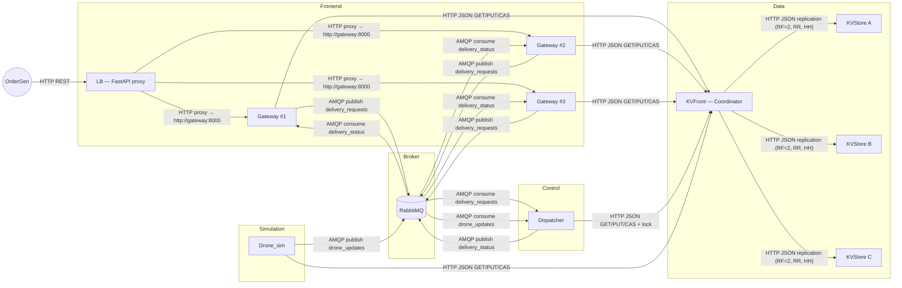
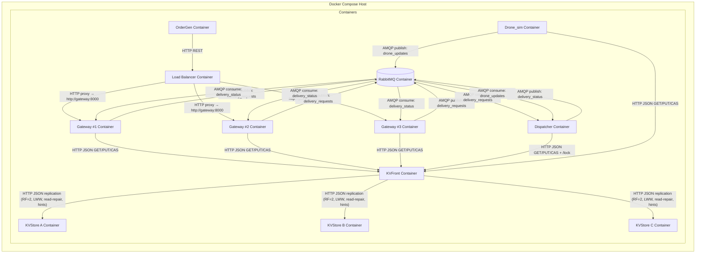
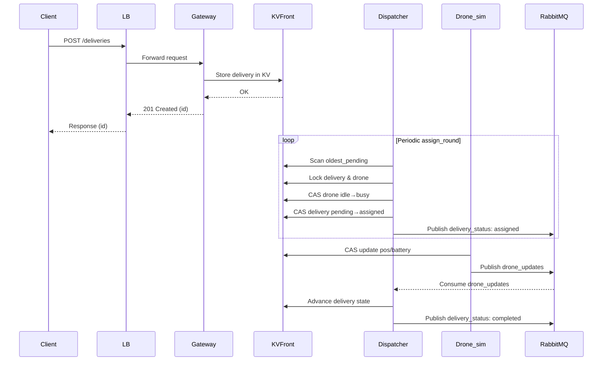

# DroneDispatch — Sistema Distribuito per la Gestione di una Flotta di Droni (PoC)

> **Stato**: Proof of Concept funzionante, progettato per dimostrare architetture distribuite (microservizi, broker di messaggi, key-value store replicato, bilanciamento, consistenza, caching, container).

## 1. Introduzione

Il progetto **DroneDispatch** è un sistema distribuito per il coordinamento di una flotta di droni simulati destinati a effettuare consegne in ambito urbano.  
L’obiettivo principale è realizzare un **Proof of Concept (PoC)** che mostri in maniera concreta i concetti studiati durante il corso di architetture distribuite, applicandoli a un caso d’uso realistico ma semplificato.

Il sistema consente di:
- ricevere richieste di consegna da un client esterno,
- assegnare dinamicamente un drone idoneo (in base a posizione, batteria e capacità di carico),
- simulare il movimento del drone e l’evoluzione della sua batteria,
- tracciare in tempo reale lo stato delle consegne e dei droni,
- visualizzare il tutto tramite una dashboard web.

Il progetto è stato sviluppato interamente come **architettura a microservizi**, con ogni componente containerizzato tramite Docker e orchestrato tramite `docker-compose`.  
La comunicazione tra servizi avviene attraverso:
- **API REST** (per l’interfaccia esterna e le interrogazioni di stato),
- **RabbitMQ (AMQP)** per la gestione degli eventi,
- un **key-value store distribuito** per mantenere lo stato consistente e aggiornato.

Questo PoC non mira a coprire tutte le complessità di un sistema industriale reale, ma fornisce una base completa e funzionante su cui costruire, dimostrando:
- scalabilità (replica gateway, autoscaling droni),
- consistenza tramite CAS e lock distribuiti,
- resilienza tramite read-repair e hinted handoff,
- supporto per test e validazione delle SLO tramite script dedicati.

---

## 2. Analisi dei Requisiti

### 2.1 Requisiti Funzionali

Dal comportamento effettivo del sistema implementato, i requisiti funzionali possono essere sintetizzati come segue:

- **Registrazione dei droni simulati**  
  All’avvio, il servizio `drone_sim` registra un insieme di droni nella base dati distribuita (key-value store), inizializzandone le proprietà principali (id, posizione, tipo, livello batteria, stato).

- **Ricezione richieste di consegna**  
  Il servizio `gateway` espone endpoint REST per l’invio di nuove richieste di consegna. Ogni richiesta contiene origine, destinazione e peso del pacco.

- **Assegnazione delle consegne ai droni**  
  Il servizio `dispatcher` implementa la logica di scheduling: assegna una consegna a un drone disponibile e con batteria sufficiente, scegliendo tra i candidati in base a prossimità e idoneità.

- **Simulazione dello stato dei droni**  
  Il servizio `drone_sim` aggiorna periodicamente posizione e livello batteria dei droni, muovendoli verso gli obiettivi previsti (origine/destinazione o stazione di ricarica).

- **Gestione dello stato delle consegne**  
  Le consegne evolvono attraverso stati coerenti: in attesa, assegnata, in volo, completata.  
  Questo stato è persistito e aggiornato nel key-value store.

- **Monitoraggio in tempo reale**  
  La dashboard web (servita dal `gateway`) visualizza la posizione dei droni e lo stato delle consegne, interrogando periodicamente le API REST.

- **Gestione degli eventi**  
  Gli aggiornamenti dei droni vengono inviati su RabbitMQ (`drone_updates`) per essere consumati dal dispatcher e mantenere coerenza nel sistema.

---

### 2.2 Requisiti Non Funzionali

- **Scalabilità**  
  - Replica del `gateway` (scalato a 3 istanze via `docker-compose`).  
  - Capacità di aumentare il numero di droni simulati (parametro configurabile).  
  - Dispatcher e droni interamente asincroni.

- **Prestazioni e bilanciamento del carico**  
  - Bilanciamento round-robin tramite servizio `lb` che smista le richieste ai gateway.  
  - Rate limiter configurabile lato `lb`.

- **Consistenza**  
  - Uso di **CAS (Compare-and-Swap)** per aggiornamenti atomici nello store.  
  - Lock distribuiti per evitare conflitti nell’assegnazione delle consegne.  
  - Replicazione con **RF=2**, read-repair e hinted handoff nel `kvfront`.

- **Affidabilità e resilienza**  
  - Cache LRU locale nei `kvstore` per ridurre la latenza e tollerare accessi frequenti.  
  - Meccanismi di retry nelle scritture CAS e nella pubblicazione RabbitMQ.  
  - Tolleranza a guasti parziali dei `kvstore`.

- **Deployment e portabilità**  
  - Ogni componente è containerizzato con `Dockerfile` dedicato.  
  - Orchestrazione tramite `docker-compose` con healthcheck e dipendenze dichiarate.

- **Osservabilità**  
  - Access log lato `lb` per il monitoraggio delle performance.  
  - Script `tests/slo_watch.sh` per la verifica passiva delle SLO.

---

## 3. Progettazione Architetturale

Questa sezione descrive **l’architettura reale** del sistema implementato: componenti (microservizi), responsabilità, interazioni (API/protocolli), motivazioni tecnologiche, e come sono stati affrontati i temi chiave dei sistemi distribuiti (scalabilità, bilanciamento, caching, consistenza, tolleranza ai guasti e resilienza). Includiamo anche diagrammi che riflettono ciò che è stato realizzato nei codici.

---

### 3.1 Componenti e responsabilità

**lb (Simple LB)**
- Proxy HTTP/1.1 keep-alive verso `gateway` (`TARGET_URL`). 
- **Rate limiting**: globale e per-client (token bucket) opzionale e configurabile via env.
- Retry *best-effort* per richieste idempotenti (GET/HEAD/PUT/DELETE) e POST con `Idempotency-Key`.
- Access log: tiene traccia di tutte le richieste, così da poter misurare con i test le performance e verificare se il sistema rispetta gli obiettivi

**gateway**
- Espone **API REST** esterne (ad es. `/deliveries`, `/zones`, `/dashboard`).
- Scrive/legge stato su `kvfront` via HTTP.
- (Nel PoC) è dietro `lb` e può essere **scalato** (compose `--scale gateway=3`).
- La dashboard legge i dati dagli stessi endpoint REST (best-effort).

**kvfront (coordinatore)**
- **Replica set**: per chiave (consistent hashing minimale)
- **RF configurabile** (quante copie di ogni dato mantenere).
- **LWW (Last-Write-Wins)**: se due versioni dello stesso dato arrivano da repliche diverse, vince quella col timestamp più recente.
- **Read path**: legge da tutte le repliche del set, sceglie la più recente, e, se trova versioni vecchie fa un **read-repair** fa un read-repair per aggiornarle.
- **Write path**: tenta su tutte le repliche; se down → **hinted handoff** con flush periodico.
- **CAS distribuita**: CAS “logica” sul primario + replicazione best-effort su secondarie.
- **Lock distribuito**: inoltro al primario per acquire/release.

**kvstore (A/B/C)**
- **Persistenza**: SQLite come database locale.
- **Cache LRU** che conserva solo un numero limitato di elementi e byte
- **Espone API HTTP per**:  
  - leggere/scrivere valori (`/kv/{key}`)  
  - fare operazioni CAS (`/kv/cas`)  
  - gestire lock locali (`/lock/*`)  
  - controllare lo stato di salute (`/health`)  
- **CAS atomica locale**:confronta il valore attuale e lo aggiorna solo se non è cambiato.

**dispatcher**  
- **Event-driven + periodic loop**:  
  - Consumer `delivery_requests` (assegnazione immediata).  
  - Consumer `drone_updates` (advance mirato).  
  - Producer `delivery_status` (pubblica aggiornamenti sullo stato delle consegne).  
  - Loop periodico: `autoscale_by_type`, `govern_charging_and_retiring`, `advance_deliveries`, `assign_round`, `reconcile_stuck_busy`.  
- **Scheduling/assegnazione**:  
  - Selezione drone idoneo (`pick_drone`): classe peso, batteria, fattibilità energetica pos→origin→dest→charge, *bucket* distanza, *proximity rank* per zone.  
  - **Lock distribuiti** delivery/drone + **CAS doppi** (drone idle→busy; delivery pending→assigned) con rollback.  
 
- **Autoscaling logico** della flotta**:  
  - Gestione stati `inactive/idle/charging/retiring` per adeguare la capacità al backlog.  
  - Non scala i container, ma **ottimizza** l’uso della flotta disponibile.  

**drone_sim**
- **Bootstrap flotta**: registra `drone_pool_max` droni (id, type: light/medium/heavy, speed frazionale).
- **Tick per-drone** (async):
  - Legge stato, calcola nuovo `pos/battery/at_charge`, scrive con **CAS + retry** (merge minimale).
  - Se “charging/retiring”: naviga verso `nearest_charge_point`, poi ricarica progressiva.
  - Enqueue eventi su `drone_updates` tramite **publisher dedicato** con backoff.

**rabbitmq**
- *Durable queues* per trigger e aggiornamenti: `delivery_requests`, `drone_updates`, `delivery_status`.

---

### 3.2 Interazioni & protocolli

**Protocolli**  
- **HTTP**  
  - tra `lb ↔ gateway`  
  - tra `gateway/dispatcher/drone_sim ↔ kvfront/kvstore`  

- **AMQP (RabbitMQ)**  
  - `delivery_requests`: publisher (gateway) → consumer (dispatcher)  
  - `drone_updates`: publisher (drone_sim) → consumer (dispatcher)  
  - `delivery_status`: publisher (dispatcher) → consumer (gateway/dashboard)  

---

### 3.3 Scelte tecnologiche (motivazioni)

- **Python + FastAPI** per servizi HTTP/REST (rapidità di sviluppo, async I/O, tipizzazione Pydantic dove serve).
- **httpx** async per client HTTP (timeout chiari, pooling/keep-alive).
- **aio-pika + RabbitMQ (AMQP)** per decoupling event-driven (robuste code durabili).
- **SQLite** nei `kvstore` incapsulato dietro un **KV API** coerente.
- **LRU cache** in-memory nei `kvstore` (riduzione latenza/carico DB).
- **Docker** + `docker-compose` (riproducibilità, scaling del gateway, orchestrazione locale).
- **CAS + lock**: meccanismi espliciti di **consistenza** sulla singola chiave interessata.

---

### 3.5 Aspetti chiave dei sistemi distribuiti (come li abbiamo indirizzati)

- **Scalabilità**
  - Orizzontale del **gateway** (repliche dietro `lb`).
  - Numero di droni e tick asincroni configurabili.
  - Coordinator `kvfront` su più backends `kvstore`.

- **Bilanciamento del carico**
  - `lb` come reverse proxy per le API pubbliche; gateway replicas servite in round-robin.
  - **Rate limiter** opzionale nel `lb` per proteggere il backend.

- **Caching**
  - **LRU cache** lato `kvstore` su **tutte** le letture/PUT.
  - **Cache in-process** della config zone (`_ZCFG`) in `dispatcher` e uso puntuale in `drone_sim`.

- **Consistenza dei dati**
  - **CAS** per aggiornamenti concorrenti (drone state, delivery state).
  - **Lock distribuiti** (acquire/release) per sezioni critiche (assegnazione).
  - **LWW** + **read-repair** + **hinted handoff** in `kvfront` (repliche eventuali ma convergenti).

- **Tolleranza ai guasti & resilienza**
  - `kvfront` tollera **repliche down** (hinted handoff) e ripara in lettura.
  - Publisher eventi con **retry/backoff**;
  

- **Osservabilità**
  - **Access log** nel `lb` con tempi in millisecondi → monitoraggio passivo delle SLO (`tests/slo_watch.sh`).
  - **Dashboard web** servita dal `gateway`: visualizza posizione, batteria e stato dei droni, oltre allo stato delle consegne.
  - Script di test end-to-end.

---

### 3.6 Diagrammi

#### 3.6.1 Component diagram

---

#### 3.6.2 Deployment Diagram

#### 3.6.3 Sequence Diagram 

#### (Flusso Event-Driven (con coda delivery_requests))

#### Flusso Diretto (Polling Periodico assign_round)

## 4. Piano di Sviluppo

Il percorso di sviluppo del Proof of Concept (PoC) è stato organizzato in **milestone incrementali**, ciascuna volta a introdurre un componente chiave e verificarne il corretto funzionamento all’interno del sistema distribuito.

### 4.1 Milestone principali

1. **Setup ambiente e orchestrazione base**
   - Creazione dei `Dockerfile` per ciascun servizio.
   - Configurazione di `docker-compose.yml` con servizi minimi (RabbitMQ, kvstore, kvfront).
   - Test di avvio e comunicazione base tra i container.

2. **Implementazione del Key-Value Store**
   - Realizzazione di `kvstore` con persistenza in SQLite e cache LRU in-memory.
   - Implementazione delle API REST `/kv`, `/kv/cas`, `/lock/*`.
   - Introduzione di CAS atomica locale e gestione lock in-process.
   - Test funzionale delle operazioni base di scrittura/lettura.

3. **Introduzione del Coordinatore KV (kvfront)**
   - Aggiunta della logica di replica (RF), LWW (Last-Write-Wins).
   - Gestione di read-repair e hinted handoff.
   - CAS distribuita e lock forwarding.
   - Validazione con più istanze di `kvstore`.

4. **Implementazione del gateway API**
   - Esposizione delle API REST esterne (`/deliveries`, `/zones`, `/dashboard`).
   - Integrazione con `kvfront` per stato consegne e droni.
   - Verifica tramite chiamate HTTP dirette e dashboard statica.

5. **Load Balancer**
   - Implementazione di `lb` come proxy FastAPI verso `gateway`.
   - Introduzione di rate-limiting e retry per richieste idempotenti.
   - Scalabilità del gateway (`--scale gateway=3`) testata tramite Compose.

6. **Simulatore dei droni (drone_sim)**
   - Registrazione iniziale della flotta di droni.
   - Loop asincrono per aggiornamento posizione/batteria e invio eventi RabbitMQ.
   - Gestione CAS + retry sugli aggiornamenti per consistenza.

7. **Dispatcher (orchestratore)**
   - Consumo eventi `delivery_requests` e `drone_updates`.
   - Algoritmi di scheduling: selezione del drone in base a batteria, distanza, capacità.
   - Avanzamento stato consegne e autoscaling logico della flotta.
   - Integrazione con lock distribuiti e CAS doppi per consistenza.

8. **Test end-to-end e osservabilità**
   - Script `tests/` per verificare la correttezza dei flussi.
   - `slo_watch.sh` per osservabilità passiva di SLO (latenza media assegnazione e consegna).
   - Validazione finale con flotta simulata e traffico generato.

### 4.2 Strategia seguita
Il piano ha seguito un approccio **incrementale e modulare**:
- Prima la costruzione del **substrato dati** (KV store + coordinatore).  
- Poi le **API e l’accesso esterno** (gateway + load balancer).  
- Successivamente la **simulazione della flotta** e l’**orchestrazione delle consegne** (drone_sim + dispatcher).  
- Infine i **test di sistema** e la **dashboard** per osservabilità.  

Questo ha permesso di validare ogni componente separatamente e poi integrarlo gradualmente nel sistema distribuito.

---

## 5. Sviluppo del Proof of Concept (PoC)

Il Proof of Concept realizzato implementa in modo funzionante e verificabile i requisiti minimi previsti dalla traccia.  

### 5.1 Funzionalità implementate

- **Registrazione dei droni simulati**
  - Il servizio `drone_sim` registra automaticamente una flotta di droni all’avvio (`drone:ID` e `drones_index` nel KV).
  - Ogni drone ha attributi: `id`, `type` (light/medium/heavy), `battery`, `pos`, `status`, `speed`.

- **Ricezione richieste di consegna**
  - Il servizio `gateway` espone un endpoint REST `/deliveries` che permette l’inserimento di nuove consegne.
  - Le richieste vengono salvate nel `kvfront` e propagate ai `kvstore`.

- **Algoritmo di assegnazione**
  - Il `dispatcher` riceve eventi (`delivery_requests`, `drone_updates`) e decide quale drone assegnare in base a:
    - idoneità per peso pacco,
    - livello di batteria sufficiente per la missione,
    - distanza da origine/destinazione.
  - Assegnazione realizzata con **lock distribuiti** e **CAS doppi** per garantire consistenza tra stato drone e stato consegna.

- **Simulazione aggiornamenti droni**
  - Ogni drone aggiorna periodicamente posizione e batteria con step frazionali (fluido sulla dashboard).
  - Stato salvato in KV con **CAS + retry** per evitare sovrascritture concorrenti.
  - Eventi su `drone_updates` vengono pubblicati su RabbitMQ e consumati dal `dispatcher`.

- **Tracciamento stato consegne**
  - Le consegne passano da `pending` → `assigned` → `in-progress` → `delivered`.
  - Lo stato è mantenuto nel KV store, leggibile via API.

- **Endpoint per stato droni e consegne**
  - Il `gateway` espone API REST per consultare lo stato corrente (sia droni che consegne).
  - La **dashboard web** legge questi endpoint e visualizza i dati su mappa e tabella.

### 5.2 Tecnologie del PoC
Il PoC integra tecnologie e concetti studiati a lezione:
- **API REST** (FastAPI, HTTP/JSON).
- **Sistemi a broker** (RabbitMQ, code AMQP per richieste ed eventi).
- **Key-Value store distribuito** (replica e coordinamento KV con consistency best-effort).
- **Container e orchestrazione** (`Docker`, `docker-compose`, scaling del gateway).
- **Meccanismi di consistenza** (CAS, lock distribuiti).
- **Bilanciamento del carico** (`lb` con round-robin e rate-limiter opzionale).

### 5.3 Risultato
Il PoC dimostra un **sistema distribuito funzionante** in cui:
- I droni vengono gestiti e monitorati in tempo reale.
- Le consegne vengono ricevute, assegnate e tracciate correttamente.
- Tutte le interazioni avvengono tramite interfacce standard (API REST, AMQP).
- L’architettura è containerizzata, scalabile e osservabile tramite dashboard e script di test.
