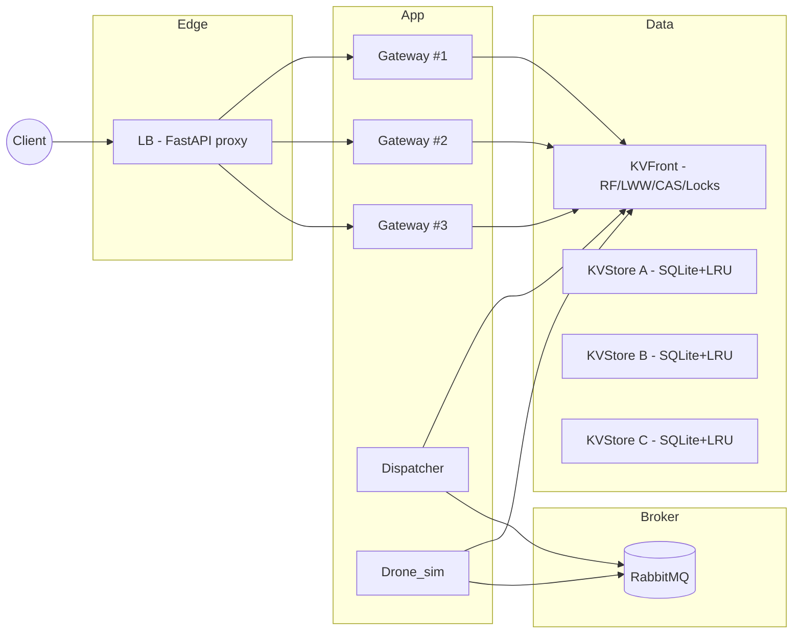
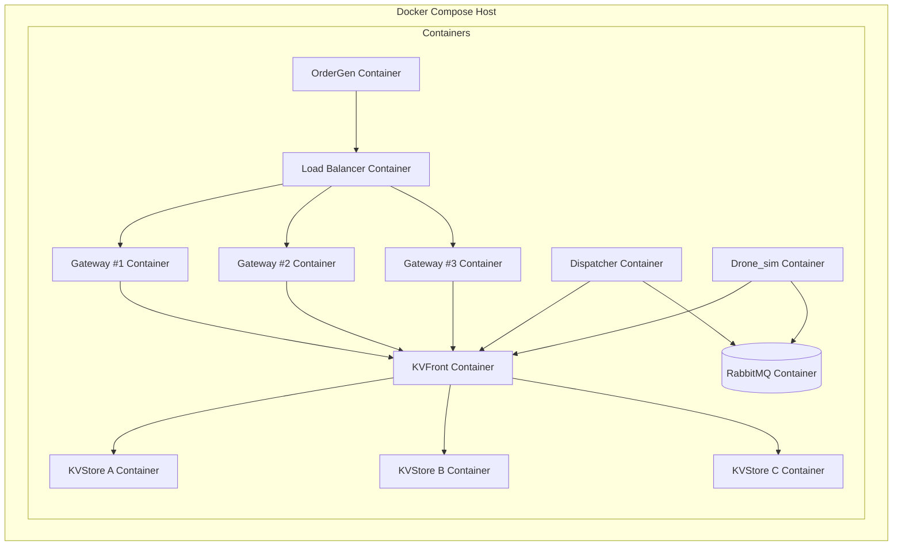
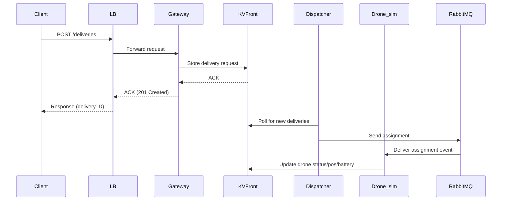

# DroneDispatch — Sistema Distribuito per la Gestione di una Flotta di Droni (PoC)

> **Stato**: Proof of Concept funzionante, progettato per dimostrare architetture distribuite (microservizi, broker di messaggi, key-value store replicato, bilanciamento, consistenza, caching, container).

---

## Indice
1. [Analisi dei Requisiti](#1-analisi-dei-requisiti)  
2. [Progettazione Architetturale](#2-progettazione-architetturale)  
   2.1 [Componenti / Microservizi](#21-componenti--microservizi)  
   2.2 [Interazioni e Protocolli](#22-interazioni-e-protocolli)  
   2.3 [Motivazioni Tecnologiche](#23-motivazioni-tecnologiche)  
   2.4 [Scalabilità, LB, Caching, Consistenza, Resilienza](#24-scalabilità-lb-caching-consistenza-resilienza)  
   2.5 [Diagramma componenti](#25-diagramma-dei-componenti)  
   2.6 [Diagramma di deployment](#26-diagramma-di-deployment)  
   2.7 [Diagrammi di sequenza](#27-diagrammi-di-sequenza)  
3. [Piano di Sviluppo (retrospettivo)](#3-piano-di-sviluppo-retrospettivo)  
4. [Sviluppo del PoC: cosa è implementato](#4-sviluppo-del-poc-cosa-è-implementato)  
5. [Test](#5-test)  
6. [Guida al Deployment ed Esecuzione](#6-guida-al-deployment-ed-esecuzione)  
7. [Evoluzioni Future](#7-evoluzioni-future)

---

## 1. Introduzione

Il progetto **DroneDispatch** è un sistema distribuito per il coordinamento di una flotta di droni simulati destinati a effettuare consegne in ambito urbano.  
L’obiettivo principale è realizzare un **Proof of Concept (PoC)** che mostri in maniera concreta i concetti studiati durante il corso di architetture distribuite, applicandoli a un caso d’uso realistico ma semplificato.

Il sistema consente di:
- ricevere richieste di consegna da un client esterno,
- assegnare dinamicamente un drone idoneo (in base a posizione, batteria e capacità di carico),
- simulare il movimento del drone e l’evoluzione della sua batteria,
- tracciare in tempo reale lo stato delle consegne e dei droni,
- visualizzare il tutto tramite una dashboard web.

Il progetto è stato sviluppato interamente come **architettura a microservizi**, con ogni componente containerizzato tramite Docker e orchestrato tramite `docker-compose`.  
La comunicazione tra servizi avviene attraverso:
- **API REST** (per l’interfaccia esterna e le interrogazioni di stato),
- **RabbitMQ (AMQP)** per la gestione degli eventi,
- un **key-value store distribuito** per mantenere lo stato consistente e aggiornato.

Questo PoC non mira a coprire tutte le complessità di un sistema industriale reale, ma fornisce una base completa e funzionante su cui costruire, dimostrando:
- scalabilità (replica gateway, autoscaling droni),
- consistenza tramite CAS e lock distribuiti,
- resilienza tramite read-repair e hinted handoff,
- supporto per test e validazione delle SLO tramite script dedicati.


---

## 2. Analisi dei Requisiti

### 2.1 Requisiti Funzionali

Dal comportamento effettivo del sistema implementato, i requisiti funzionali possono essere sintetizzati come segue:

- **Registrazione dei droni simulati**  
  All’avvio, il servizio `drone_sim` registra un insieme di droni nella base dati distribuita (key-value store), inizializzandone le proprietà principali (id, posizione, tipo, livello batteria, stato).

- **Ricezione richieste di consegna**  
  Il servizio `gateway` espone endpoint REST per l’invio di nuove richieste di consegna. Ogni richiesta contiene origine, destinazione e peso del pacco.

- **Assegnazione delle consegne ai droni**  
  Il servizio `dispatcher` implementa la logica di scheduling: assegna una consegna a un drone disponibile e con batteria sufficiente, scegliendo tra i candidati in base a prossimità e idoneità.

- **Simulazione dello stato dei droni**  
  Il servizio `drone_sim` aggiorna periodicamente posizione e livello batteria dei droni, muovendoli verso gli obiettivi previsti (origine/destinazione o stazione di ricarica).

- **Gestione dello stato delle consegne**  
  Le consegne evolvono attraverso stati coerenti: in attesa, assegnata, in volo, completata.  
  Questo stato è persistito e aggiornato nel key-value store.

- **Monitoraggio in tempo reale**  
  La dashboard web (servita dal `gateway`) visualizza la posizione dei droni e lo stato delle consegne, interrogando periodicamente le API REST.

- **Gestione degli eventi**  
  Gli aggiornamenti dei droni vengono inviati su RabbitMQ (`drone_updates`) per essere consumati dal dispatcher e mantenere coerenza nel sistema.

---

### 2.2 Requisiti Non Funzionali

- **Scalabilità**  
  - Replica del `gateway` (scalato a 3 istanze via `docker-compose`).  
  - Capacità di aumentare il numero di droni simulati (parametro configurabile).  
  - Dispatcher e droni interamente asincroni.

- **Prestazioni e bilanciamento del carico**  
  - Bilanciamento round-robin tramite servizio `lb` che smista le richieste ai gateway.  
  - Rate limiter configurabile lato `lb`.

- **Consistenza**  
  - Uso di **CAS (Compare-and-Swap)** per aggiornamenti atomici nello store.  
  - Lock distribuiti per evitare conflitti nell’assegnazione delle consegne.  
  - Replicazione con **RF=2**, read-repair e hinted handoff nel `kvfront`.

- **Affidabilità e resilienza**  
  - Cache LRU locale nei `kvstore` per ridurre la latenza e tollerare accessi frequenti.  
  - Meccanismi di retry nelle scritture CAS e nella pubblicazione RabbitMQ.  
  - Tolleranza a guasti parziali dei `kvstore`.

- **Deployment e portabilità**  
  - Ogni componente è containerizzato con `Dockerfile` dedicato.  
  - Orchestrazione tramite `docker-compose` con healthcheck e dipendenze dichiarate.

- **Osservabilità**  
  - Access log lato `lb` per il monitoraggio delle performance.  
  - Script `tests/slo_watch.sh` per la verifica passiva delle SLO.

---

## 3. Progettazione Architetturale

Questa sezione descrive **l’architettura reale** del sistema implementato: componenti (microservizi), responsabilità, interazioni (API/protocolli), motivazioni tecnologiche, e come sono stati affrontati i temi chiave dei sistemi distribuiti (scalabilità, bilanciamento, caching, consistenza, tolleranza ai guasti e resilienza). Includiamo anche diagrammi (in Mermaid) che riflettono **esattamente** ciò che c’è nei codici.

---

### 3.1 Panorama generale

Il sistema è composto da più servizi containerizzati che collaborano per ricevere richieste di consegna, assegnarle a droni idonei e tracciare in tempo reale lo stato di droni e consegne.

- **lb/** — *Simple Load Balancer (FastAPI)*: proxy HTTP verso `gateway`, con rate-limiter opzionale e retry idempotente.
- **gateway/** — *API esterne*: espone REST per /deliveries, /zones, dashboard; dietro `lb`, può essere scalato a più repliche.
- **kvfront/** — *Coordinatore KV*: sharding/replica RF, CAS lato front, read-repair, hinted handoff, lock distribuiti.
- **kvstore/** (A/B/C) — *Storage KV replicato (SQLite + LRU cache)*: API /kv, /kv/cas, lock in-process; backing store per lo stato.
- **dispatcher/** — *Orchestrazione*: scheduling/assegnazione, avanzamento stato consegne, autoscaling logico della flotta, consumer AMQP.
- **drone_sim/** — *Simulatore droni*: registra la flotta, aggiorna posizione/batteria, pubblica eventi su RabbitMQ.
- **rabbitmq** — *Broker AMQP*: code `delivery_requests`, `drone_updates`, `delivery_status`.
- **tests/** — script di test end-to-end e SLO watch (passivo).
- **docker-compose** — orchestrazione dei container e scaling del `gateway`.

---

### 3.2 Componenti e responsabilità

**lb (Simple LB)**
- Proxy HTTP/1.1 keep-alive verso `gateway` (`TARGET_URL`).
- **Rate limiting** globale e per-client (token bucket) opzionale via env.
- Retry *best-effort* per richieste idempotenti (GET/HEAD/PUT/DELETE) e POST con `Idempotency-Key`.
- Access log con timing per SLO passivo.

**gateway**
- Espone **API REST** esterne (ad es. `/deliveries`, `/zones`, `/dashboard`).
- Scrive/legge stato su `kvfront` via HTTP.
- (Nel PoC) è dietro `lb` e può essere **scalato** (compose `--scale gateway=3`).
- La dashboard legge i dati dagli stessi endpoint REST (best-effort).

**kvfront (coordinatore)**
- **Replica set** per chiave (consistent hashing minimale): `replica_set(key)` su BACKENDS.
- **RF configurabile** (tagliato a |BACKENDS|).
- **LWW (Last-Write-Wins)**: `wrap(value)` con `_ts`, `unwrap(...)` per confronto temporale.
- **Read path:** legge da tutte le repliche del set, sceglie la più recente, **read-repair** (C2).
- **Write path:** tenta su tutte; se down → **hinted handoff** (C3) con flush periodico.
- **CAS distribuita**: CAS “logica” sul primario + replicazione best-effort su secondarie.
- **Lock distribuito**: inoltro al primario per acquire/release.

**kvstore (A/B/C)**
- **Persistenza**: SQLite WAL + PRAGMA tuning.
- **Cache LRU thread-safe** con limiti su item e byte.
- **API**: `/kv/{key}`, `/kv/cas`, `/lock/*`, `/health`.
- **CAS atomica locale** (transazione SQLite) con confronto **strutturale** JSON.

**dispatcher**
- **Event-driven + periodic loop**:
  - Consumer `delivery_requests` (assegnazione immediata).
  - Consumer `drone_updates` (advance mirato).
  - Loop periodico: `autoscale_by_type`, `govern_charging_and_retiring`, `advance_deliveries`, `assign_round`, `reconcile_stuck_busy`.
- **Scheduling/assegnazione**:
  - Selezione drone idoneo (`pick_drone`): classe peso, batteria, fattibilità energetica pos→origin→dest→charge, *bucket* distanza, *proximity rank* per zone.
  - **Lock distribuiti** delivery/drone + **CAS doppi** (drone idle→busy; delivery pending→assigned) con rollback.
- **Consistenza operativa**:
  - Helper CAS robusti (idle↔busy) con retry e micro-backoff.
  - Guard asimmetrie e “stuck busy”.
- **Autoscaling logico** della flotta (stato `inactive/idle/charging/retiring`) per adeguare la capacità al backlog (non scala i container, ma **ottimizza** l’uso della flotta).

**drone_sim**
- **Bootstrap flotta**: registra `n_total` droni (id, type: light/medium/heavy, speed frazionale).
- **Tick per-drone** (async):
  - Legge stato, calcola nuovo `pos/battery/at_charge`, scrive con **CAS + retry** (merge minimale).
  - Se “charging/retiring”: naviga verso `nearest_charge_point`, poi ricarica progressiva.
  - Enqueue eventi su `drone_updates` tramite **publisher dedicato** con backoff.
- **Coordinamento con dispatcher**: rispetto `freeze_until` per evitare CAS “a rimbalzo”.

**rabbitmq**
- *Durable queues* per trigger e aggiornamenti: `delivery_requests`, `drone_updates`, `delivery_status`.

---

### 3.3 Interazioni & protocolli

**Protocolli**
- **HTTP/JSON** tra `lb ↔ gateway` e `gateway/dispatcher/drone_sim ↔ kvfront/kvstore`.
- **AMQP** (RabbitMQ) tra `drone_sim/producer` → `dispatcher/consumers` e (opzionalmente) publisher di richieste.

**Flussi principali**
- **Richiesta consegna**: Client → **lb** → gateway (REST). Stato consegna in KV. Assegnazione:
  - *immediata* se un publisher invia un evento su `delivery_requests` (dispatcher consumer),
  - *oppure* nel **giro periodico** `assign_round` (fairness FIFO con `oldest_pending`).
- **Aggiornamento drone**: `drone_sim` → KV (CAS) + evento `drone_updates` → dispatcher `advance_for_drone`.

---

### 3.4 Scelte tecnologiche (motivazioni)

- **Python + FastAPI** per servizi HTTP/REST (rapidità di sviluppo, async I/O, tipizzazione Pydantic dove serve).
- **httpx** async per client HTTP (timeout chiari, pooling/keep-alive).
- **aio-pika + RabbitMQ (AMQP)** per decoupling event-driven (robuste code durabili, QoS/prefetch).
- **SQLite** nei `kvstore` (semplice, transazionale, veloce con WAL), incapsulato dietro un **KV API** coerente.
- **LRU cache** in-memory nei `kvstore` (riduzione latenza/carico DB).
- **Docker** + `docker-compose` (riproducibilità, scaling del gateway, orchestrazione locale).
- **CAS + lock**: meccanismi espliciti di **consistenza** a granularità di chiave, in puro user-space via API HTTP.

---

### 3.5 Aspetti chiave dei sistemi distribuiti (come li abbiamo indirizzati)

- **Scalabilità**
  - Orizzontale del **gateway** (repliche dietro `lb`).
  - Numero di droni e tick asincroni configurabili.
  - Coordinator `kvfront` su più backends `kvstore`.

- **Bilanciamento del carico**
  - `lb` come reverse proxy per le API pubbliche; gateway replicas servite in round-robin.
  - **Rate limiter** opzionale nel `lb` per proteggere il backend.

- **Caching**
  - **LRU cache** lato `kvstore` su **tutte** le letture/PUT.
  - **Cache in-process** della config zone (`_ZCFG`) in `dispatcher` e uso puntuale in `drone_sim`.

- **Consistenza dei dati**
  - **CAS** per aggiornamenti concorrenti (drone state, delivery state).
  - **Lock distribuiti** (acquire/release) per sezioni critiche (assegnazione).
  - **LWW** + **read-repair** + **hinted handoff** in `kvfront` (repliche eventuali ma convergenti).

- **Tolleranza ai guasti & resilienza**
  - `kvfront` tollera **repliche down** (hinted handoff) e ripara in lettura.
  - Publisher eventi con **retry/backoff**; consumer con QoS (prefetch) e robust connect.
  - Timeouts espliciti nelle chiamate HTTP, retry per CAS, rollback coerenti.

- **Osservabilità**
  - **Access log** nel `lb` con tempi ms → SLO passivo (`tests/slo_watch.sh`).
  - Script di test end-to-end e smoke per ordergen (opzionale).

---

### 3.6 Diagrammi

#### 3.6.1 Component diagram



---


#### 3.6.2 Deployment Diagram
```markdown

#### 3.6.3 Sequence Diagram (Richiesta di Consegna)
```markdown
